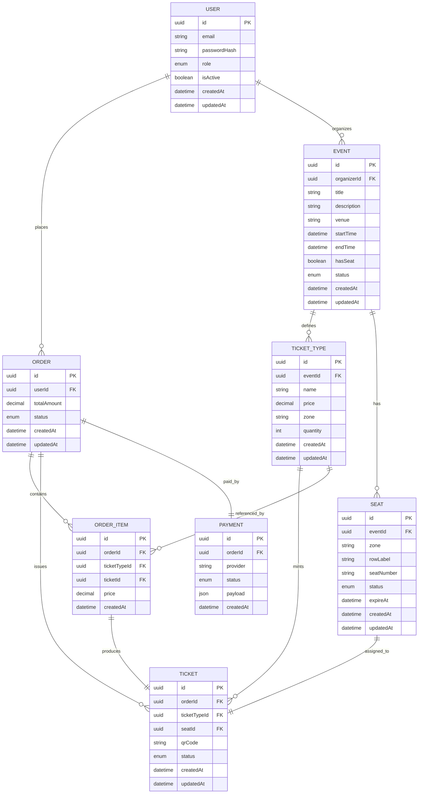

# 🏪 EventHub – Event Management

EventHub là hệ thống backend quản lý sự kiện và bán vé, được xây dựng với mục tiêu mô phỏng **một sản phẩm thực tế trong môi trường doanh nghiệp**.

Dự án tập trung vào việc thiết kế **kiến trúc monolithic chuẩn**, xử lý các **nghiệp vụ cốt lõi và phức tạp** của nền tảng bán vé như quản lý sự kiện, kiểm soát tồn kho vé, xử lý đơn hàng và thanh toán, đồng thời tối ưu hiệu năng và độ ổn định của hệ thống.

---

## Project Overview

EventHub cung cấp backend API cho một nền tảng bán vé với ba nhóm người dùng chính:

- **User**: xem sự kiện, mua vé, quản lý đơn hàng
- **Organizer**: tạo và quản lý sự kiện, cấu hình vé
- **Admin**: quản trị toàn hệ thống


## 📋 Mô tả dự án


- **Frontend**: Next.js với TypeScript, Tailwind CSS + SCSS
- **Backend**: NestJS với TypeScript, Swagger UI
- **Database**: PostgreSQL, Prisma ORM ,  Migration & transaction , Soft delete
- **Authentication & Authorization** : JWT (access token & refresh token), Role-based access control (USER / ORGANIZER / ADMIN) , Custom guards & decorators
- **Features**: Server-Side Rendering, SEO-optimized

## 📁 Cấu trúc dự án

```
eventhub/
├── fe/                    # Frontend - Next.js TypeScript
│   ├── src/app/          # App Router pages
│   ├── src/styles/       # SCSS variables & mixins
│   ├── src/utils/        # Constants & utilities
│   └── next.config.ts    # Next.js configuration
└── be/                    # Backend - NestJS
    ├── src/modules/      # User, Admin, Common modules
    └── src/main.ts       # Entry point với Swagger
```

## 🛠️ Yêu cầu hệ thống

- **Node.js**: >= 16.x
- **npm**: >= 8.x hoặc **yarn**: >= 1.22.x

## 🚀 Hướng dẫn cài đặt và chạy dự án

### 1. Clone repository

```bash
git clone <repository-url>
cd minishop
```

### 2. Cài đặt và chạy Backend

| **npm**              | **yarn**          |
| -------------------- | ----------------- |
| `cd be`              | `cd be`           |
| `npm install`        | `yarn install`    |
| `npm run start:dev`  | `yarn start:dev`  |
| `npm run build`      | `yarn build`      |
| `npm run start:prod` | `yarn start:prod` |

**Backend chạy trên:** `http://localhost:4301`  
**Swagger API:** `http://localhost:4301/api`

### 3. Cài đặt và chạy Frontend

| **npm**         | **yarn**       |
| --------------- | -------------- |
| `cd fe`         | `cd fe`        |
| `npm install`   | `yarn install` |
| `npm run dev`   | `yarn dev`     |
| `npm run build` | `yarn build`   |
| `npm start`     | `yarn start`   |

**Frontend chạy trên:** `http://localhost:4300`

## 🔧 Scripts chính

### Frontend

| **npm**         | **yarn**     | **Mô tả**                        |
| --------------- | ------------ | -------------------------------- |
| `npm run dev`   | `yarn dev`   | Development server với Turbopack |
| `npm run build` | `yarn build` | Build cho production             |
| `npm start`     | `yarn start` | Chạy production server           |
| `npm run lint`  | `yarn lint`  | Lint code với ESLint             |

### Backend

| **npm**             | **yarn**         | **Mô tả**                  |
| ------------------- | ---------------- | -------------------------- |
| `npm run start:dev` | `yarn start:dev` | Development với hot reload |
| `npm run start`     | `yarn start`     | Production mode            |
| `npm run build`     | `yarn build`     | Build TypeScript           |
| `npm run lint`      | `yarn lint`      | Lint code                  |

## 📱 Truy cập ứng dụng

- **Frontend**: http://localhost:4300 (Giao diện người dùng)
- **Backend API**: http://localhost:4301 (API endpoints)
- **Swagger Documentation**: http://localhost:4301/api

## 🛣️ Routes

- `/` → Trang chủ user
- `/admin` → Admin dashboard
- API endpoints: `/user/home`, `/admin/dashboard`, `/common/share`

## 📝 Ghi chú

- **Ports**: Frontend (4300), Backend (4301)
- **Package Manager**: Có thể dùng npm hoặc yarn (không trộn lẫn)
- **Development**: Yarn thường nhanh hơn và cache tốt hơn
# eventHub



