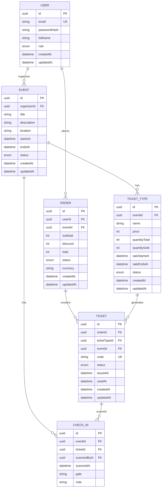

```mermaid
erDiagram
  USER ||--o{ EVENT : organizes
  USER ||--o{ ORDER : places
  EVENT ||--o{ TICKET_TYPE : has
  ORDER ||--o{ TICKET : contains
  TICKET_TYPE ||--o{ TICKET : generates
  EVENT ||--o{ CHECK_IN : has
  TICKET ||--o{ CHECK_IN : scanned

  USER {
    uuid id PK
    string email UK
    string passwordHash
    string fullName
    enum role
    datetime createdAt
    datetime updatedAt
  }

  EVENT {
    uuid id PK
    uuid organizerId FK
    string title
    string description
    string location
    datetime startsAt
    datetime endsAt
    enum status
    datetime createdAt
    datetime updatedAt
  }

  TICKET_TYPE {
    uuid id PK
    uuid eventId FK
    string name
    int price
    int quantityTotal
    int quantitySold
    datetime saleStartsAt
    datetime saleEndsAt
    enum status
    datetime createdAt
    datetime updatedAt
  }

  ORDER {
    uuid id PK
    uuid userId FK
    uuid eventId FK
    int subtotal
    int discount
    int total
    enum status
    string currency
    datetime createdAt
    datetime updatedAt
  }

  TICKET {
    uuid id PK
    uuid orderId FK
    uuid ticketTypeId FK
    uuid eventId FK
    string code UK
    enum status
    datetime issuedAt
    datetime usedAt
    datetime createdAt
    datetime updatedAt
  }

  CHECK_IN {
    uuid id PK
    uuid eventId FK
    uuid ticketId FK
    uuid scannedById FK
    datetime scannedAt
    string gate
    string note
  }

```
