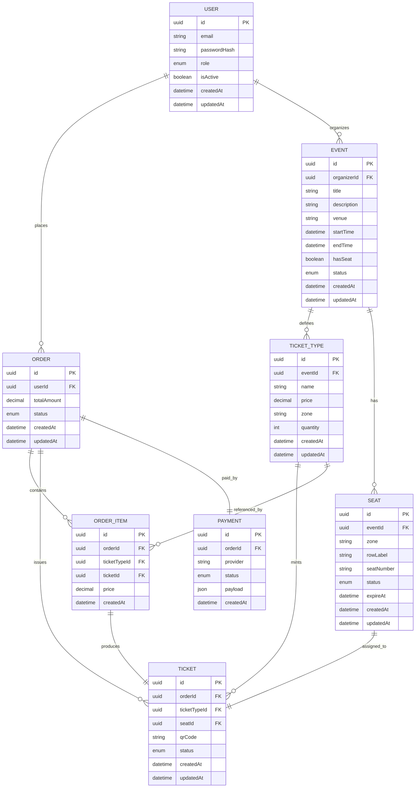

```mermaid
erDiagram
    USER ||--o{ ORDER : places
    USER ||--o{ EVENT : organizes

    EVENT ||--o{ TICKET_TYPE : defines
    EVENT ||--o{ SEAT : has

    ORDER ||--o{ ORDER_ITEM : contains
    ORDER ||--o{ TICKET : issues
    ORDER ||--|| PAYMENT : paid_by

    TICKET_TYPE ||--o{ TICKET : mints
    TICKET_TYPE ||--o{ ORDER_ITEM : referenced_by

    SEAT ||--|| TICKET : assigned_to

    ORDER_ITEM ||--|| TICKET : produces

    USER {
        uuid id PK
        string email
        string passwordHash
        enum role
        boolean isActive
        datetime createdAt
        datetime updatedAt
    }

    EVENT {
        uuid id PK
        uuid organizerId FK
        string title
        string description
        string venue
        datetime startTime
        datetime endTime
        boolean hasSeat
        enum status
        datetime createdAt
        datetime updatedAt
    }

    TICKET_TYPE {
        uuid id PK
        uuid eventId FK
        string name
        decimal price
        string zone
        int quantity
        datetime createdAt
        datetime updatedAt
    }

    SEAT {
        uuid id PK
        uuid eventId FK
        string zone
        string rowLabel
        string seatNumber
        enum status
        datetime expireAt
        datetime createdAt
        datetime updatedAt
    }

    ORDER {
        uuid id PK
        uuid userId FK
        decimal totalAmount
        enum status
        datetime createdAt
        datetime updatedAt
    }

    ORDER_ITEM {
        uuid id PK
        uuid orderId FK
        uuid ticketTypeId FK
        uuid ticketId FK
        decimal price
        datetime createdAt
    }

    TICKET {
        uuid id PK
        uuid orderId FK
        uuid ticketTypeId FK
        uuid seatId FK
        string qrCode
        enum status
        datetime createdAt
        datetime updatedAt
    }

    PAYMENT {
        uuid id PK
        uuid orderId FK
        string provider
        enum status
        json payload
        datetime createdAt
    }

```
